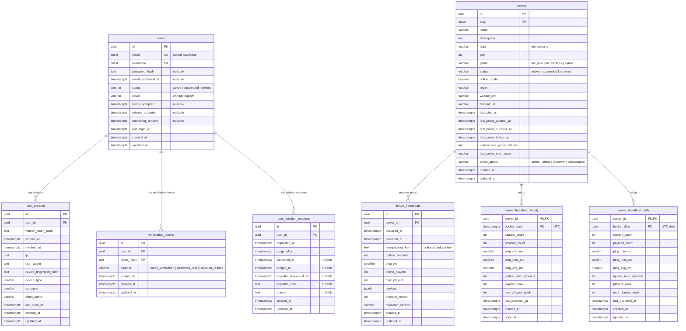

# FirstSpawn Database Schema Design

## MVP Schema (v1)

v1 is intentionally focused:

- Email/password auth
- Admin-populated server list
- Server heartbeat freshness and retention rollups
- Soft-delete with delayed purge and restore flow

## Constraints And Policies

- Use `varchar + CHECK` (not PostgreSQL enums) for constrained fields.
- `users.username` is DB-constrained to `^[A-Za-z0-9_]{3,32}$`.
- `servers.slug` is globally unique and never reused.
- `server_heartbeats` dedupe uniqueness is scoped by `(server_id, idempotency_key)`.
- `servers.status` is catalog/moderation state only: `active`, `suspended`, or `archived`.
- Collectors target active `mc_java` rows regardless of heartbeat freshness or probe confidence.
- Probe confidence is tracked separately with `servers.probe_status` and the `last_probe_*` columns.
- `users.status = 'deleted'` means pending purge, not yet hard-deleted.

## Retention And Lifecycle

- Raw `server_heartbeats` retention: 14 days for all servers.
- Server archive policy:
  - Archive only from explicit catalog/admin evidence.
  - Collector silence, stale `last_ping_at`, failed probes, DNS failures, or network reachability failures must not archive rows.
- User soft-delete policy:
  - Default purge window: 30 days.
  - Expedite request window: 24 hours.
  - Restore allowed until final purge.

## New Tables Close-Up (Phase 2)

The following tables are intentionally out of MVP scope.

### Engagement And Trust

- `reviews`
- `review_votes`
- `review_moderation_actions`
- `server_reputation_snapshots`
- `favorites`

### Moderation

- `reports`

### Plugin And Telemetry

- `plugin_keys`
- `playtime_events`

### Agentic Ops

- `agent_runs`
- `action_proposals`
- `decision_logs`

## Notes

- Keep `servers` admin-populated in v1.
- Ping and payload jobs run only for active servers.
- Suggested heartbeat cadence:
  - Ping every 5 minutes
  - Payload every 30 minutes
